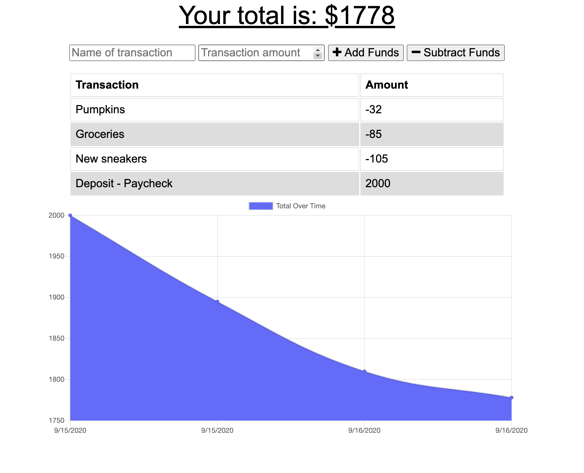

# No-Excuses-The-Budget-App
Keep your account balanced with The Budget App.  Users can add expenses and deposits to their budget with or without an internet connection.

## Table of Contents
1. [About](#about)
2. [Languages Used](#languages)
3. [Contributing](#contribute)
4. [Access & Appearance](#access) 

## About 

Great for travelers or people trying to achieve any financial goal. It uses a line graph to visually display their current saving and spending habits over time. No Excuses is a pwa application, so it can installed on any device.  

## Languages and Technologies Used 

Powered by:
- Mongo
- Node.js
- Express.js

## Contributing 

If you are interested in contributing to this project, feel free to fork this repository and open a pull request to suggest changes.

## Access and Appearance 

<a href="https://no-excuses-the-budget-app.herokuapp.com/" target="_blank">LINK to application</a>

